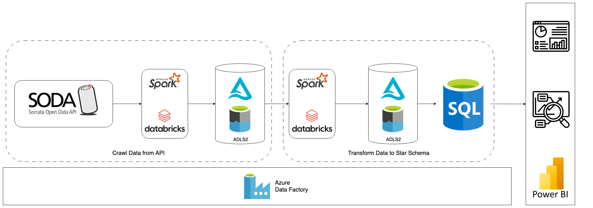
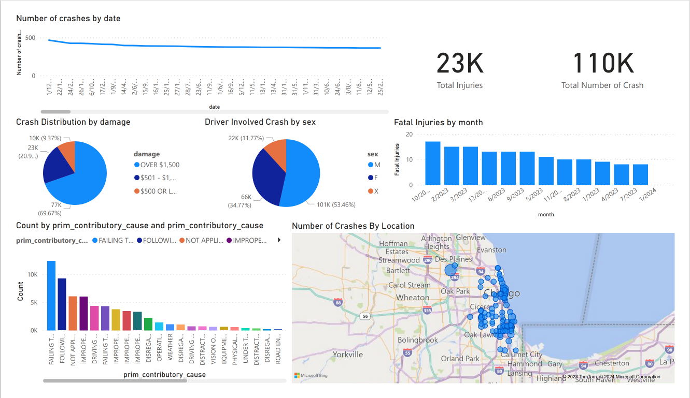

# Chicago Crashes Data Modeling
## Overview
This project aims to process data crawled from Soda API related to crashes happended in Chicago and conduct analysis from processed data.

## **Tools & Technology**
- Azure DataBricks
- Apache Spark (Pyspark)
- Azure Datalake Storage Gen2
- Azure Data Factory
- Azure Sql Database
- Language: Python

## Data Architecture

The project is built using multiple services on Azure Cloud Provider following these steps:
* Data was cleansed (handling missing values, inconsistent value, inconsistent data type, etc.) and ingested to Data Lakehouse managed by Delta lake hosted on ADLS Gen2.
* Data is loaded incrementally using Watermarking technique to keep track of latest timestamp of data table. 
* Then cleansed data will be transformed to star schema by using Pyspark in Azure DataBricks.
* Transformed data will be stored in Data Warehouse hosted by SQL Database for analysis.
* PowerBI was used for data visualization and data analysis. 
* Finally, Azure Data Factory was used to manage and schedule processing workflow in this project.

## Data Model

The image below is visualized result star schema:

This star schema use Mini Dimension to manage slowly changing dimension such as condition of traffic control divice and road condition. Bridge table was used to manage dimensions that have M:N relationship with fact table such as Vehicle Dimension or Person Dimension.

This data model can be used to answer against these questions:
* How many crashes happened in different granularity hour, day, month, week, year, day of week?
* How many fatal injuries in crashes in different granularity hour, day, month, week, year, day of week?
* What is the distribution of driver who cause crashes based on gender?
* What is the most primary cause of crashes?
* How many crashes happened in different weather condition?
* Damage distribution of crashes?* What is the most collision type in crashes?
* etc.

## Mantain Security

Some security practices applied to this project:
* All services communicate to each other using Virtual Network (VNet) and private endpoints instead of using public access network.
* Encryption data at rest.
* Encryption data in transit.
* Data masking for sensitive information.
* Manage data access on ADLS Gen2 via Role-based Access and Access Control List (ACLs).

## Example
The example visualization from data warehouse after transform from raw data:

